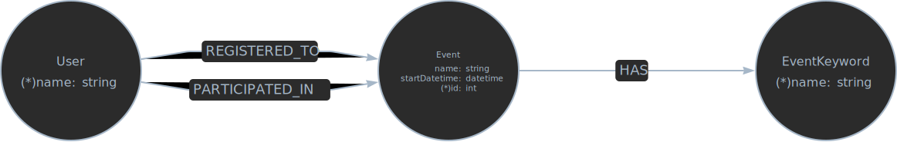

# event-net

**Created by**:
 - Bartosz Czyż
 - Marceli Mietła

## How to run

1. Copy `.env.example` as `.env` and change values if needed.

2. Run command in the app's root folder (where compose.yaml folder is):

> [!WARNING]
> You have to had installed docker

```
docker compose up
```

Or to auto reload after file change:

```
docker compose up --watch
```
## Data model

> [!NOTE]
> Properties with (*) are required and uniqe



## Importing example data

1. Run command in app's root folder (where compose.yaml folder is):
```bash
docker compose exec neo4j sh
cypher-shell -u $DB_USER -p $DB_PASSWORD --file /import/import.cypher
```